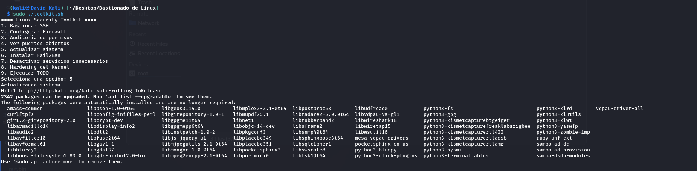
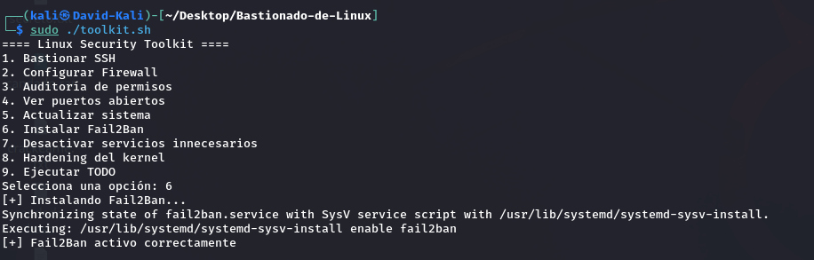
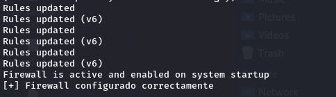
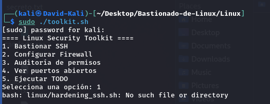
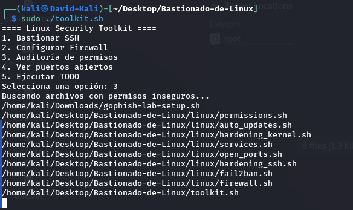
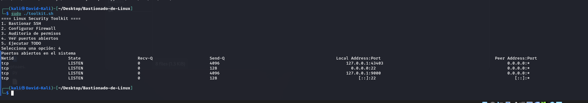
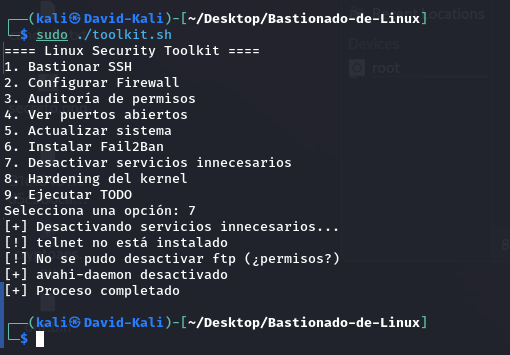
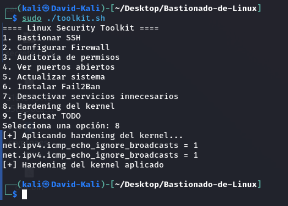

# Linux Hardening Toolkit

Toolkit de herramientas para bastionar sistemas Linux.

Escenario:
Servidor Ubuntu expuesto a internet con SSH abierto.

Riesgos:
- Fuerza bruta SSH
- Puertos abiertos innecesarios
- Permisos inseguros

Solución aplicada:
- Hardening SSH
- Configuración de firewall
- Instalación de Fail2Ban
- Auditoría de permisos

Resultado:
Sistema más seguro y con menor superficie de ataque.

## Herramientas

auto_updates.sh
Actualiza el sistema e instala actualizaciones automáticas.


fail2ban.sh
Protege contra ataques de fuerza bruta. Fail2Ban monitoriza los logs del sistema y bloquea automáticamente direcciones IP que realizan múltiples intentos fallidos de autenticación, mitigando ataques de fuerza bruta.


firewall.sh
Configura firewall con UFW.


hardening_ssh.sh
Desactiva login root y autenticación por contraseña.


permissions.sh
Detecta archivos con permisos inseguros.


open_ports.sh
Lista puertos abiertos del sistema.


services.sh
Desactiva servicios innecesarios.


hardening_kernel.sh
Aplica configuraciones de seguridad del kernel.


## Instalación

Clonar el repositorio:

```bash
git clone https://github.com/Hunt3r2/Bastionado-de-Linux.git
cd Bastionado-de-Linux

#dar permisos a los scripts
chmod +x *.sh linux/*.sh

#dar permiso al script principal
sudo ./toolkit.sh
```

## Ejemplo de ejecución

Ejecución del toolkit:

```bash
sudo ./toolkit.sh

==== Linux Security Toolkit ====
1. Bastionar SSH
2. Configurar Firewall
3. Auditoría de permisos
4. Ver puertos abiertos
5. Actualizar sistema
6. Instalar Fail2Ban
7. Desactivar servicios innecesarios
8. Hardening del kernel
9. Ejecutar TODO
Selecciona una opción: 7
[+] Desactivando servicios innecesarios...
[!] telnet no está instalado o usa otro nombre
[!] ftp existe pero no se pudo desactivar
[+] avahi-daemon desactivado
[+] Proceso completado

```

### Extra

Como extra, se añadió un pequeño script para windows que desactiva servicios inseguros

- disable_services.ps1
  - Desactiva servicios inseguros

## Descripción técnica

El toolkit está desarrollado en Bash y utiliza herramientas nativas de Linux como:

- systemctl para gestión de servicios
- ufw para configuración de firewall
- sysctl para parámetros del kernel
- find para auditoría de permisos
- ss para análisis de puertos

Se implementa validación de errores y comprobación de dependencias para garantizar su funcionamiento en distintos entornos.

## Limitaciones

- Algunos servicios pueden no estar instalados en todos los sistemas
- Requiere permisos de superusuario (sudo)
- Diseñado principalmente para sistemas Debian/Ubuntu/Kali